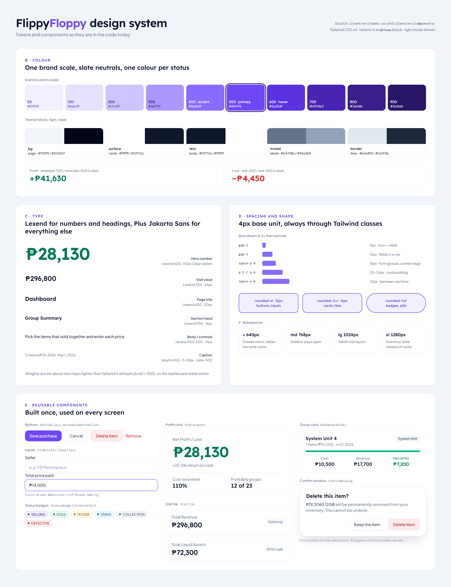

# 3. Design System

> Written down from the real `client/src/index.css` and `client/src/components/` (2026-09-01),
> not decided fresh. The accessibility check was run against the actual code, and it found two
> real problems, both fixed on 2026-09-03.

*The design system as a picture, made on 2026-10-09 from the current `client/src/index.css` and components. It shows the week 3 versions (profit card, stat tiles, confirm window) and the lighter font weights. The tables below are the Sep 1 write-up.*

## A. Styling approach

**Tailwind CSS v4.** The tokens live in an `@theme` block inside `index.css`, not in
`tailwind.config.js` (v4 moved configuration into CSS). Declaring `--color-brand-500` there creates
the `bg-brand-500`, `text-brand-500` and `border-brand-500` classes used everywhere.

## B. Colour tokens

The app has one custom scale (**brand**), uses Tailwind's built-in **slate** for neutrals, and
borrows four built-in colours for statuses. That's more than the worksheet's 3–5 colours, because an
inventory app built around statuses needs more than one accent to stay readable. Each colour still
has one named job.

**brand**

| Step | Hex |
| --- | --- |
| 50 | `#f2f0ff` |
| 100 | `#e6e1ff` |
| 200 | `#cfc4ff` |
| 300 | `#ab97ff` |
| 400 | `#8a6bff` |
| 500 | `#6f47f5` |
| 600 | `#5a32df` |
| 700 | `#4924b3` |
| 800 | `#3a1e8c` |
| 900 | `#2a1666` |

**Status colours**, kept separate from the brand accent:

| Status | Colour |
| --- | --- |
| SOLD, positive numbers | emerald |
| DEFECTIVE, negative numbers | red |
| TESTER | amber |
| USING | sky |
| COLLECTION | slate |
| SELLING | brand |

| Token | Role | Colour (hex) |
| --- | --- | --- |
| `--color-primary` | links, buttons, active states | `#6f47f5` (brand-500) |
| `--color-accent` | one call-to-action, highlights | `#8a6bff` (brand-400) |
| `--color-bg` | page background | `#f1f5f9` light / `#020617` dark |
| `--color-surface` | cards, panels | `#ffffff` light / `#0f172a` dark |
| `--color-text` | body text | `#0f172a` light / `#ffffff` dark |

Background, surface and text have two values each because the app supports light and dark mode.
Swapping that one value re-themes the whole screen, which is the point of naming it `--color-bg`
instead of repeating a hex code.

## C. Type scale

Two fonts, each with its own job. **Lexend** is used only for headings and numbers that need weight.
**Plus Jakarta Sans** is used for every sentence, label and control.

| Style | Size | Weight | Used for |
| --- | --- | --- | --- |
| Page title | 18–20px | Lexend 700 | Top-bar heading on each route |
| Section head | 16px | Lexend 700 | Card-group headers, modal titles |
| KPI value | 24–26px | Lexend 800 | `SummaryCard` figures |
| Body / control | 14px | Jakarta 500–600 | Buttons, inputs, table cells, form labels |
| Caption | 11–12px | Jakarta 500 | Metadata lines, table headers, status pills |

Body text defaults to weight 500 instead of 400. A dashboard full of numbers and short labels reads
better slightly bolder than a page of prose would.

## D. Spacing rule

The base unit is Tailwind's **4px**, always used through Tailwind's spacing classes (`gap-3`, `p-5`) and never as a raw number.

| Use | Size | Tailwind |
| --- | --- | --- |
| Tight: icon ↔ label, dot ↔ text | 4px | `gap-1` |
| Compact: fields in a row, list items | 12px | `gap-3` |
| Standard: form groups in one card | 16px | `space-y-4` |
| Screen edge: phone / desktop | 16 / 24px | `px-4` / `sm:px-6` |
| Card padding | 20 / 24px | `p-5` / `p-6` |
| Between page sections | 32px | `space-y-8` |

## E. Reusable components

| Component | Level | Appears on | Props |
| --- | --- | --- | --- |
| `StatusSelect` | atom | Inventory, Group Detail, Edit Group, Edit Item | `status`, `onChange`, `disabled?` |
| `SummaryCard` | molecule | Dashboard, Monthly Summary, Price Index | `title`, `value`, `subtitle?`, `tone?`, `icon?` |
| `Layout` | organism | every logged-in screen (wraps `<Outlet/>`) | none; reads the current route, `AuthContext` and `ThemeContext` |
| `EditItemModal` | organism | Inventory, Group Detail, Edit Group | `item`, `onClose` |
| `Skeletons` (`Bone`, `StatCardSkeleton`, `TableSkeleton`, one per screen) | atom → organism | every screen that loads data, while it loads | none (the `Bone` shape takes `className`) |
| card / button / input classes | atom | every screen and form | exported class-name constants rather than components |

## F. Responsive plan

| Breakpoint | What changes |
| --- | --- |
| < 640px (phone) | Sidebar becomes a ☰ drawer; tables become stacked cards; form grids become 1 column |
| `sm` 640px | KPI grid 1 → 2 columns; paired form fields 1 → 2 columns |
| `md` 768px | Drawer becomes a permanent sidebar; card lists become data tables |
| `lg`/`xl` 1024–1280px | KPI grid 4 across; group grid 3 across |

**Rule: no sideways scrolling at 375px.** Every screen meets this. Price Index's sale-history table was the last exception, fixed in week 2 (Sep 27, 2026) with the same stacked cards as Monthly Summary.

## Accessibility check

| Check | Result |
| --- | --- |
| Text contrast | **Failed, then fixed.** White on `brand-500` buttons is 5.4:1 ✓, `slate-500` on white is 4.8:1 ✓, white on `slate-900` is 17.9:1 ✓. The green profit text (`emerald-600` on white) was only **3.8:1**, below 4.5:1. It was changed to `emerald-700` (5.5:1) on 2026-09-03 |
| Real semantic elements | Pass: `<header>`, `<nav>` and `<main>` in `Layout`; actions are real `<button>` and `<select>` elements |
| Meaningful `alt` text | Pass: the logo always sits next to the visible "FlippyFloppy" wordmark, so `alt=""` (decorative) is correct |
| Every input has a label | Pass: every field is wrapped in a `<label>` |
| Reachable with Tab, visible focus | **Failed, then fixed.** Clickable Inventory and Group Detail rows were `
`/`<tr>` elements with only `onClick`. On 2026-09-03 they got `tabIndex={0}`, `role="button"`, an Enter/Space handler and a visible focus ring |
